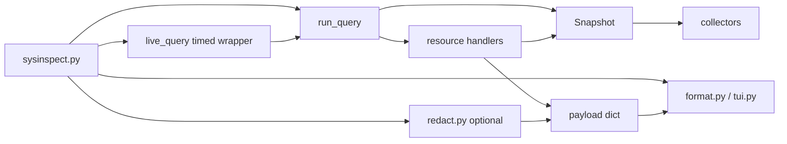

# Architecture

System Inspector is a local CLI. It reads Linux system interfaces (sysfs, `/proc`, psutil, optional `lspci` / `nmcli`) and prints hardware stats or JSON. There is no server, no config file, and no background daemon.

## Data flow



1. **`sysinspect.py`** — argparse, live TUI loop, `--json` / `--plain` / `--redact`.
2. **`run_query()`** in `resources.py` — turns tokens like `gpu temp` into one or more resource payloads. Collector failures return `{"ok": false, ...}` instead of crashing the CLI.
3. **`Snapshot`** — lazy cache for inventory, vitals, and expensive net slices (connections, listen, public IP, …) for the lifetime of one query.
4. **Resource handlers** — build JSON-shaped dicts (`status`, `gpu`, `net`, …). They read through `Snapshot`; they do not re-fetch ad hoc.
5. **`format.py`** — human text; **`tui.py`** — colors, meters, live dashboard, charts.
6. **`redact.py`** — optional mask for serials / UUIDs before output.
7. **`live_query.py`** — live mode only: `run_query_timed()` with a 2.5s wall clock cap; on timeout the UI keeps the last good payload and shows “refresh slow”.

## Directory roles

| Path | Role |
|------|------|
| `sysinspect.py`, `sysinspect`, `si` | Entry points |
| `backend/collectors/` | Talk to the OS; return plain dicts |
| `backend/snapshot.py` | Per-query cache (inventory, vitals, net slices) |
| `backend/resources.py` | Aliases, `parse_query`, resource builders, field filters |
| `backend/fields.py` | OS / net field token sets shared by query + format |
| `backend/format.py` | Terminal formatting |
| `backend/tui.py` | Live UI, banners, plotext graphs |
| `backend/live_query.py` | Live-mode query timeout wrapper |
| `backend/redact.py` | Sensitive field masking |
| `backend/help_text.py` | Text for `si help` |
| `tests/` | pytest |

## Collectors

Each file under `backend/collectors/` owns one domain:

- **`inventory.py`** — static hardware list via other collectors
- **`vitals.py`** — live CPU/RAM/GPU/disk/net rates, fans, battery
- **`util.py`** — `run_cmd()` (subprocess, no shell, timeouts → `None`), `read_text()`, `safe_dict()`

Collectors should not import from `resources` or `format`. They return data; they do not format output.

Subprocess timeouts in `run_cmd()` return `None`; callers treat that as “data unavailable.” Uncaught exceptions in a resource handler are caught in `run_query()` and turned into error payloads.

## Query language

Tokens map through `ALIASES` and `FIELD_ALIASES` in `resources.py`. Examples:

- `si gpu` → resource `gpu`
- `si gpu temp` → resource `gpu`, field filter `temp`
- `si kernel` → resource `os`, field `kernel`
- `si version` → app version (not OS); `si os version` → distro name

Network sub-commands (`si net ip`, `connections`, …) use `NET_FIELD_ALIASES` in `fields.py`. Expensive net slices go through `Snapshot.net_*()` so repeated field filters in one query do not re-run collectors.

## GPU inventory vs live stats

Inventory discovers cards via NVML, lspci, or DRM. Live stats come from NVML, nvidia-smi, or hwmon.

NVML + lspci inventory is merged by **PCI BDF** (short `01:00.0` and `0000:01:00.0` are the same slot). Unmatched lspci NVIDIA cards are kept, not glued onto the first NVML entry.

`merge_gpu_devices()` matching order:

1. PCI BDF / NVML index (when both sides expose them)
2. Vendor + name heuristics (fallback)

Tests cover single-GPU, dual identical NVIDIA (two PCI slots), and iGPU + dGPU laptop layouts.

## Live mode

Interactive live runs `run_query_timed()` inside `paint()`. If collection exceeds **2.5s** (e.g. `si live net public`), the UI returns immediately, keeps the previous payload, and shows **refresh slow**. The slow worker is left running; the next refresh reaps it instead of stacking another query. One-shot commands (`si net public`) are not capped.

## Security and privacy

- **Local only** — nothing listens on a port.
- **Subprocess** — `run_cmd()` uses argument lists and timeouts; no `shell=True`.
- **Network** — only `si net public` calls an external HTTPS IP service (user-initiated).
- **Sensitive data** — scan, board, and `--json` dumps can include DMI serials, UUIDs, SKUs, connection tables. Use **`--redact`** when piping logs or sharing output (masks serials, UUIDs, boot_id, part_number, sku, asset_tag). IPs, MACs, hostnames, and SSIDs are left intact.
- **Permissions** — `net connections` / `listen` may need elevated privileges on some systems for full process names.

## Adding a new command

1. Add collector logic in `backend/collectors/` if new data is needed.
2. Add a `resource_*()` handler in `resources.py` and register it in `HANDLERS`.
3. Add aliases to `ALIASES` (and field aliases if sliceable).
4. Add a branch in `format.py` `format_human()` for display.
5. If it appears in live mode, extend `extract_metrics()` in `tui.py`.
6. Add tests in `tests/` for parsing and formatting.

## Dev commands

```bash
./install.sh                              # venv + ~/.local/bin wrappers
.venv/bin/pip install -r requirements-dev.txt
.venv/bin/pytest
si status
si gpu --json
si scan --json --redact
```

To reset a stale venv from the old web stack: `rm -rf .venv && ./install.sh`
