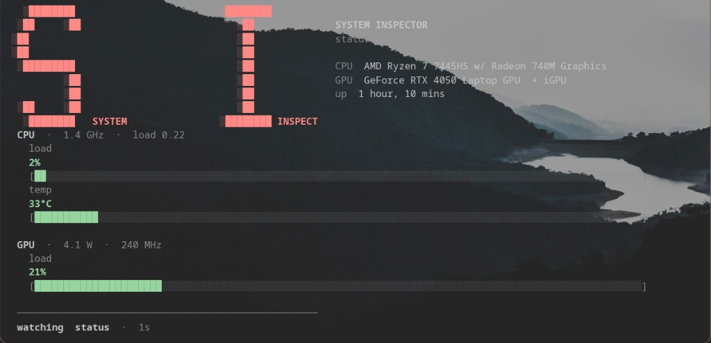

<div align="center">
  
</div>

A terminal utility to monitor temperatures, loads, disks, network activity, and check hardware specs.

Run `si` or `sysinspect` from any folder 

---

## Installation

```bash
git clone https://github.com/nnapkin12/System-Inspector.git
cd System-Inspector
./install.sh
```

`./install.sh` puts `si` and `sysinspect` into `~/.local/bin`. If `nvidia-smi` is on PATH, it also installs NVIDIA's Python NVML bindings; AMD/Intel machines skips.

If you get **command not found**, add that folder to your PATH once, then open a new terminal:

```bash
echo 'export PATH="$HOME/.local/bin:$PATH"' >> ~/.bashrc
source ~/.bashrc
```

---

## Usage Examples

### Components

```bash
si status          # main vitals, nice looking terminal fetch
si gpu             # GPU stats
si cpu             # CPU stats
si ram             # Memory/swap
si motherboard     # Board/ BIOS info
si display         # connected displays (resolution, refresh Hz)
si battery         # laptop batt
si fans            # fans speed, sometimes not reported
si disk            # disks and free space
si scan            # full hardware specs scan
```

### Metrics, and other computer specs

```bash
si temps           # All hardware temperatures
si status          # system overview
si uptime          # uptime
si os              # kernel, desktop, distro
si version         # this app's version
```

### Target a specific component + its metric

```bash
si gpu temps
si cpu temps
si gpu load
si cpu load
```

### Live terminal refresh (default on a TTY)

Sensors update by themselves. others like `si os` / `si display` / `si scan` print once.

```bash
si gpu                        # live GPU board
si cpu temps                  # live CPU temperature
si gpu cpu temps              # combine components
si gpu --interval 0.5         # faster refresh / type 'faster' or 'slower' then Enter
si gpu --once                 # one snapshot
```

`si live …` still works. While it is running, type `cpu`, `gpu`, or any live component to switch.

---

## Network

```bash
si net                  # speed, gateway, DNS, IPv4 / IPv6
si net connections      # every socket (process, local → remote)
si net listen           # listening ports
si net ip               # addresses per interface
si net wifi             # connected SSID + nearby networks
si net ping             # ping default gateway (LAN)
si net public           # public IP (needs internet)
```

colored text for connection health (green, yellow, red)

More commands: [COMMANDS.md](COMMANDS.md)

---

## Scripts / JSON

if you want JSON outputs instead:

```bash
si gpu --json
si net connections --json
si scan --json --redact
```

`--redact` masks serials, UUIDs, boot_id, sku, and asset tags before printing.

Other flags: `--plain` / `-p` · `--verbose` / `-v` · `--interval` · `--graph` · `--no-logo` · `--pci`

`--json` works on any command.

---

## Optional web UI

The product is still the terminal. If you want a page in a browser:

```bash
si gui
```

It stays on this machine (`127.0.0.1:8000`) and prints a link to copy. Ctrl+C stops it. `si web` is the same. `--port` if 8000 is busy; `--redact` masks serials there too.

---

## Dev

```bash
./install.sh
.venv/bin/pip install -r requirements-dev.txt
.venv/bin/pytest
```

Layout: [ARCHITECTURE.md](ARCHITECTURE.md). Credits: [CONTRIBUTORS.md](CONTRIBUTORS.md).

Local only · [MIT](LICENSE)
