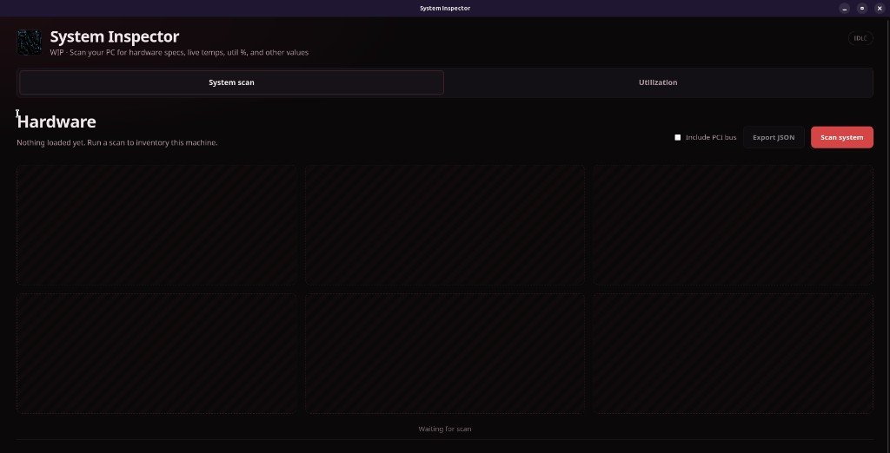
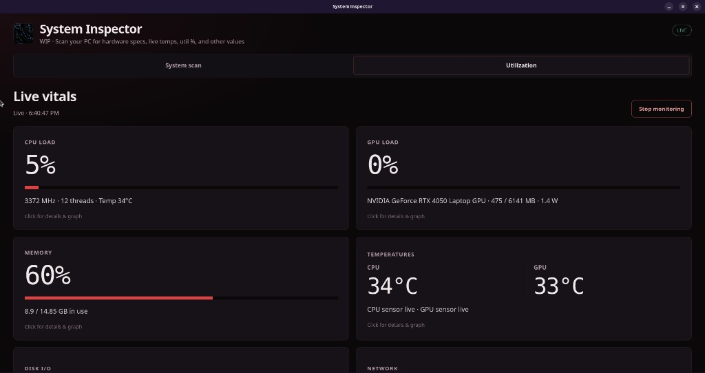
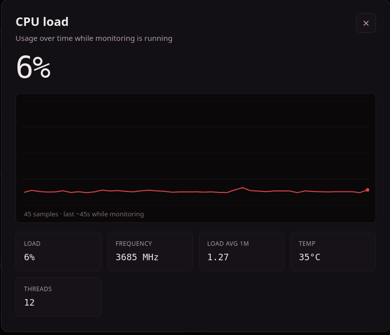

# System Inspector


Local hardware scan + live vitals on **Linux** (Windows maybe later).

**Main:** terminal CLI · **Optional:** desktop window or browser UI.

---

## Terminal (main)

After install, use from **any** terminal. No window/server required.

```bash
git clone https://github.com/nnapkin12/System-Inspector.git
cd System-Inspector
./install.sh
```

If `sysinspect` is not found:

```bash
echo 'export PATH="$HOME/.local/bin:$PATH"' >> ~/.bashrc
source ~/.bashrc
```

```bash
sysinspect status
sysinspect gpu
sysinspect cpu temp
si motherboard
sysinspect watch gpu
sysinspect help
```

**All commands → [COMMANDS.md](COMMANDS.md)**

CLI only (skip app menu): `./install.sh --cli-only`

---

## Window / browser (optional)

This displays the same data, but with UI (scan cards + live graphs).

```bash
# window
./SystemInspector

# browser (leave terminal open)
./run.sh
# → http://127.0.0.1:8787
```

If the window falls back to a browser (on Ubuntu):

```bash
sudo apt install python3-gi python3-gi-cairo gir1.2-gtk-3.0 gir1.2-webkit2-4.1
```

---

## Screenshots







---

Local only · no cloud · **MIT** ([LICENSE](LICENSE))
